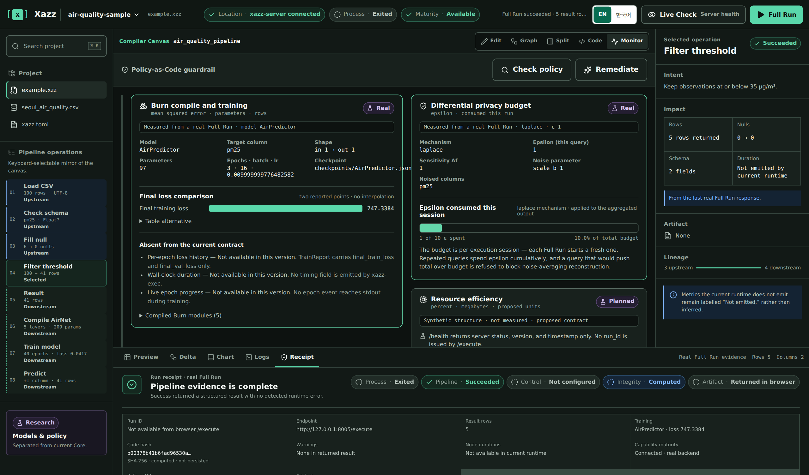

# ax1s-x1zz

**한국 고등학교 2학년 학생입니다. 데이터 파이프라인 DSL, 컴파일러, AI/ML 도구를 Rust로 개발하고 있습니다.**

[English Document](./README.md)

---

## 소개

컴파일러와 그 언어를 직접 작성합니다. 주요 작업은 `.xzz` 스크립트를 최적화된 Polars 실행 계획으로 바꾸는 일련의 DSL이며, lexer부터 codegen까지 Rust로 처음부터 구축합니다. 그 핵심 주변에는 비주얼 에디터, Python→`.xzz` 변환기(transpiler), LLM 효율성에 대한 응용 연구가 있습니다.

설계 방향은 모든 프로젝트에서 동일합니다: 오류를 런타임이 아닌 컴파일 타임으로 이동시키고, 무거운 의존성을 서브프로세스 경계 뒤에 격리해 CLI를 가볍게 유지하며, CSV에서 학습 완료 모델까지의 전체 경로를 단일 스크립트로 표현하는 것입니다.

---

## 생태계

```
[Python 코드] --> (py2xzz) ---\
                               --> [.xzz 스크립트] --> (Xazz 컴파일러) --> [실행 / Burn ML]
[비주얼 드래그앤드롭] (IDE) ----/
```

x1zzLang은 Xazz로 성장한 기반 프로젝트이며, py2xzz와 비주얼 IDE는 `.xzz` 스크립트를 Xazz 컴파일러로 공급합니다.

---

## 핀 프로젝트 (Pinned Projects)

### [Xazz](https://github.com/x1zzdev/Xazz) — AI 파이프라인 DSL

Polars 전처리, Burn 딥러닝 컴파일, 정적 보안 가드레일을 단일 `.xzz` 스크립트에 통합하는 Rust 기반 AI 파이프라인 DSL입니다.

- **기술 스택**: Rust (edition 2024), Polars, Burn, Axum / Tokio
- **주요 구현 특징**:
  - lexer → parser → 정적 타입 체커 → Rust/Polars/Burn codegen으로 이어지는 컴파일러 툴체인을 처음부터 구축
  - `Option<T>` 타입 시스템 기반 컴파일 타임 null/타입 안전성, `line:col` 진단 및 did-you-mean 제안 제공
  - pandas→NumPy→PyTorch 경계의 복사 비용 없이 Apache Arrow 버퍼를 직접 Burn에 전달하는 zero-copy 경로
  - PII/시크릿 탐지 기반 Policy-as-Code 가드레일, 세션별 엡실론 예산을 갖는 차등 프라이버시, SHA-256 append-only 감사 로그
  - `xazz-runner` 서브프로세스 경계 뒤에 무거운 엔진을 격리해 CLI 바이너리를 2–5MB로 유지하는 멀티 크레이트 워크스페이스

<p align="center">
  
</p>

### [x1zzLang](https://github.com/x1zzdev/x1zzLang) — 데이터 파이프라인 언어
데이터 분석을 쉽게 접근하도록 만드는 Rust DSL로, `.xzz` 스크립트를 최적화된 Polars LazyFrame 실행 계획으로 컴파일합니다.

- **현재 스택**: Rust, Polars, clap, serde
- **주요 구현 특징**:
  - Rust로 구현한 전체 컴파일러 파이프라인 (lexer/parser/codegen/emitter)
  - `fillNull` 연산자를 포함한 null-안전 `Option<T>` 타입 시스템
  - `x1zz import`가 CSV 스키마를 자동 추론(EUC-KR/CP949 디코딩 포함)하고 타입 선언 생성
  - `x1zz emit rust`는 `.xzz`를 독립적인 Polars LazyFrame Rust 소스로 변환
  - CLI는 Polars를 절대 링크하지 않고, 실행은 서브프로세스로 위임하는 의존성 격리
  - 이후 Xazz로 발전한 기반 프로젝트

### [py2xzz](https://github.com/x1zzdev/py2xzz) — Python → `.xzz` 변환기
Pandas / PyTorch로 작성된 Python 데이터·딥러닝 파이프라인을 `.xzz` DSL 스크립트로 변환하는 Rust CLI입니다.

- **현재 스택**: Rust, serde
- **주요 구현 특징**:
  - Python 3 `ast` 모듈 스펙을 반영한 자체 lexer/parser로 AST 생성
  - Pandas 체인은 `PipelineOp` 체인으로, `nn.Module` 클래스는 `ModelDecl`/`LayerKind`로 변환하는 매퍼
  - CSV 헤더와 샘플값에서 열 타입을 추론하며, null이 있을 때 `Option<...>`로 감싸서 처리
  - 원본 Python 줄/열 위치를 생성된 코드로 추적하는 span map 기반 진단
  - 출력은 `xazz-core` AST와 1:1 대응하며 `xazz check` 통과

### [x1zzLang Visual IDE](https://github.com/x1zzdev/x1zzLang-visual-ide)
x1zzLang용 그래픽 파이프라인 편집기 — DAG 워크플로를 시각적으로 설계하고 `.xzz` 코드를 생성하여 네이티브로 실행합니다.

- **현재 스택**: React 18, Vite, @xyflow/react, i18next
- **주요 구현 특징**:
  - 9개의 내장 파이프라인 연산자를 갖춘 드래그 앤 드롭 DAG 빌더
  - 전용 transpiler 엔진을 통한 시각적 그래프 → `.xzz` 소스 실시간 변환
  - 백엔드 대상 원클릭 실행 및 테이블 결과 표시
  - 멀티 워크플로 탭, 실행 취소/재실행, 자동 저장, 컨테이너 그룹, 한/영 UI 지원

### [LLM PCAG 연구](https://github.com/ax1s-x1zz/llm-pcag-research) — LLM 양자화의 파워 월
LLM 가중치 양자화가 실제로 얼마나 에너지를 절감하는지, 그리고 그로 인한 그리드 Jevons 역설을 계량화하는 연구입니다.

- **현재 스택**: Python (NumPy, pandas, SciPy, SymPy, Matplotlib)
- **주요 구현 특징**:
  - 양자화 효율이 정확도 손실보다 빠르게 붕괴하는 지점을 측정하는 PCAG 메트릭(출력 이득 당 전력 비용) 정의
  - 세 경로(empirical PCHIP, Monte Carlo, 해석 모델)로 INT4→INT3 'Power Wall' 검증
  - 변곡점 루트가 진폭에 독립적임을 증명
  - 수요 탄력성 E_d > 1일 때만 그리드 부하가 증가함을 SymPy로 상징적으로 증명, Jevons 역설 폐쇄형 정식화
  - 데이터 소스 라벨링(문헌 기반 vs GPU 측정)을 엄격하게 지키는 재현 가능한 실험 파이프라인

<p align="center">
  
</p>

---
### 오픈소스 기여 (Open Source Contributions)

#### [tracel-ai/burn](https://github.com/tracel-ai/burn) — Rust 딥러닝 프레임워크 (15k★)

**`TensorCheck`에 matmul 배치 브로드캐스트 검증 추가** — [머지된 PR #5555](https://github.com/tracel-ai/burn/pull/5555)

- `TensorCheck::matmul`에 배치 차원 브로드캐스트 가능성 검증을 추가했습니다. `TensorCheck`는 백엔드 디스패치 **이전에** 실행되는 공개 텐서 API 검증 레이어라서, ndarray 등 특정 백엔드에 국한되지 않고 모든 백엔드가 일관된 `Tensor Operation Error`를 받도록 했습니다 (기존에는 백엔드마다 제각각 다른 panic이 발생).
- 검증을 제거하면 테스트가 실패하도록 하는 회귀 테스트를 작성했고, 리뷰 이후 테스트 범위를 좁혀 기존 inner-dimension 검증이 아닌 이번 검증이 정확히 panic을 일으키는 경로만 검증하도록 다듬었습니다.
- 과정: 첫 PR(#5542)은 백엔드 로컬(ndarray는 deprecated) + 핫패스 힙 할당이라는 리뷰로 거절되었고, 메인테이너가 제시한 방향대로 공통 `TensorCheck` 레이어로 재작업해 리뷰를 통과하고 메인테이너가 직접 머지했습니다.

---
### 대외 활동 및 리더십 (Activities & Leadership)

#### **코드게이트 AI 스타트업 해커톤 (`Xazz / x1zz Guard`) (2026.07)**
> **역할:** 팀 리더, 프로젝트 총괄, 코어 툴체인 아키텍트
- **팀 & IP 거버넌스:** 상금 1/N 정산을 명확히 하고, 기존 개인 자산(`x1zzLang`)과 대회 신규 산출물 간의 IP 귀속 범위를 정립.
- **위기 대응:** 팀원 이탈 상황에서 역할을 신속히 재조정하여 마감 기한 내 완성도 높은 프로젝트 제출 성공.
- **기술 방어 논리:** 대량 쿼리 오버헤드 및 차등 프라이버시(DP) 성능 저하 등 심사위원이 예상하는 질의에 대한 구체적 대응책 마련.
- **보안 아키텍처:** Rust 및 온프레미스 sLM(Qwen2.5-Coder) 기반의 AST 정적 보안 통제 계층 `x1zz Guard` 설계.

#### **GEEKs Hackathon (2026.08.04 - 2026.08.05)**
> **역할:** 팀 기획자 및 발표자, 전략적 피봇 주도, 제품/UX 검증
- **전략적 피봇:** 제한된 개발 기간과 팀 기술 시너지를 고려해 복잡한 B2B PaaS에서 실현 가능한 B2C 민원 플랫폼('우선해줘')으로 전환.
- **로직 & UX 기획:** Vision AI(Claude Opus 5)와 PostGIS 공공데이터를 결합한 행정 정당성 스코어링 논리 기획.
- **발표 전담:** 기획 전환 후 발표 준비부터 실전 8분 피칭까지 전담하여 프로젝트 완성 및 공유 완료.
---

## 기술 스택 요약

| 영역 | 기술 |
|---|---|
| 시스템 / DSL | Rust (edition 2024), Cargo workspace, clap, serde |
| 데이터 엔진 | Polars (LazyFrame), Apache Arrow |
| 딥러닝 | Burn, zero-copy 텐서 전달 |
| 웹 / API | Axum, Tokio, React 18, Vite, @xyflow/react |
| 백엔드 통합 | Rust REST API, SHA-256 감사 로깅 |
| 연구 / 분석 | Python, NumPy, pandas, SciPy, SymPy, Matplotlib |

---

## 소개

이 프로젝트들은 타입 안전하고 컴파일되는 데이터 파이프라인을 향한 지속적인 탐구의 일부입니다. 컴파일러 설계, 데이터 도구, ML 인프라스트럭처에서 비슷한 문제를 다루고 있다면 언제든 연락주세요.

- **이메일**: [ax1s@x1zz.com](mailto:ax1s@x1zz.com)
